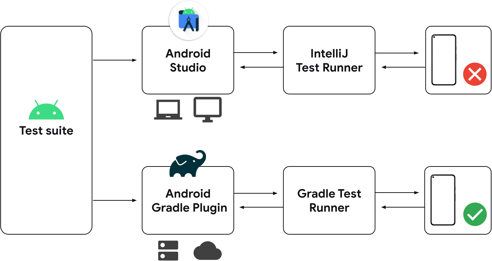

# 那些年，那些事儿 &middot; Flutter

[](https://github.com/flutter/flutter)

Hi！Welcome to **那些年，那些事儿** . The general introduction is as follows:

* **Build apps by Flutter:** Flutter is an open source framework by Google for building beautiful, natively compiled, multi-platform applications from a single codebase.
* **Fast:** Flutter code compiles to ARM or Intel machine code as well as JavaScript, for fast performance on any device.
* **Productive:** Build and iterate quickly with Hot Reload. Update code and see changes almost instantly, without losing state.
* **Flexible**: Control every pixel to create customized, adaptive designs that look and feel great on any screen.
* **Flutter 3**: Deep dive into our [latest release](https://medium.com/flutter/whats-new-in-flutter-3-8c74a5bc32d0), including macOS and Linux stable, performance improvements, and more!

> ⚠ Note:
> [Want to get to know me briefly? Click 🔗 to take a few minutes to learn about me and the code I'm writing](https://github.com/yinleiCoder).

## Prerequisites

To install and run this project, your development environment must meet these minimum requirements:

> ⚠ Note:
> To check your Windows version and build number, select Windows logo key + R, type winver, select OK. You can update to the latest Windows version by selecting Start > Settings > Windows Update > Check for updates.

* Operating Systems: Windows 10 or later(64-bit), x86-64 based.
* Disk Space: 1.64GB(does not include disk space for IDE/tools)
* Settings: Developer Mode must be enabled on Windows 10/11
* Tools: Project depends on these tools being available in your environment
  - Windows PowerShell 5.0 or newer(this is pre-installed with Windows 10)
  - Git for Windows 2.x, with the Use Git frome the Windows Command Prompt option. If Git for Windows is already installed, make sure you can run git commands from the command prompt or PowerShell
* IDE: Android Studio Chipmunk | 2021.2.1 Patch 1
* Flutter Doctor:
    ```
    Flutter assets will be downloaded from https://storage.flutter-io.cn. Make sure you trust this source!
    [√] Flutter (Channel stable, 3.0.1, on Microsoft Windows [版本 10.0.22000.675], locale zh-CN)
        • Flutter version 3.0.1 at D:\flutter
        • Upstream repository https://github.com/flutter/flutter.git
        • Framework revision fb57da5f94 (7 days ago), 2022-05-19 15:50:29 -0700
        • Engine revision caaafc5604
        • Dart version 2.17.1
        • DevTools version 2.12.2
        • Pub download mirror https://pub.flutter-io.cn
        • Flutter download mirror https://storage.flutter-io.cn

    [√] Android toolchain - develop for Android devices (Android SDK version 30.0.3)
        • Android SDK at D:\AndroidSDK
        • Platform android-31, build-tools 30.0.3
        • ANDROID_HOME = D:\AndroidSDK
        • Java binary at: D:\Android Studio\jre\bin\java
        • Java version OpenJDK Runtime Environment (build 11.0.12+7-b1504.28-7817840)
        • All Android licenses accepted.

    [√] Chrome - develop for the web
        • Chrome at C:\Program Files (x86)\Google\Chrome\Application\chrome.exe

    [√] Visual Studio - develop for Windows (Visual Studio Community 2022 17.1.0)
        • Visual Studio at D:\VisualStudio2022\Community
        • Visual Studio Community 2022 version 17.1.32210.238
        • Windows 10 SDK version 10.0.19041.0

    [√] Android Studio (version 2021.2)
        • Android Studio at D:\Android Studio
        • Flutter plugin can be installed from:
        https://plugins.jetbrains.com/plugin/9212-flutter
        • Dart plugin can be installed from:
        https://plugins.jetbrains.com/plugin/6351-dart
        • Java version OpenJDK Runtime Environment (build 11.0.12+7-b1504.28-7817840)

    [√] Connected device (3 available)
        • Windows (desktop) • windows • windows-x64    • Microsoft Windows [版本 10.0.22000.675]
        • Chrome (web)      • chrome  • web-javascript • Google Chrome 102.0.5005.62
        • Edge (web)        • edge    • web-javascript • Microsoft Edge 100.0.1185.50

    [√] HTTP Host Availability
        • All required HTTP hosts are available

    • No issues found!
    ```
* Browser: Chrome. You are free to choose your own preferred browser(for example: Firefox)
* Phone(Virtual/Physical): Pixel_4a_API_30、Pixel_5_API_31、RedMi红米
* Tablet(Virtual/Physical): Pixel_C_API_31

Of course, the above is my current configuration, you can change according to the actual situation

## Architecture

> ⚠ Note:
> You can view the progress of the current project by selecting Projects > Project.



## Contributing

If you are interested in this project, please feel free to contact me to join us and let us program happily together.
Of course, you are also welcome to actively raise issues.  
Thank you!!!

## License

**那些年，那些事儿** is [GPL-3.0 licensed](./LICENSE).
